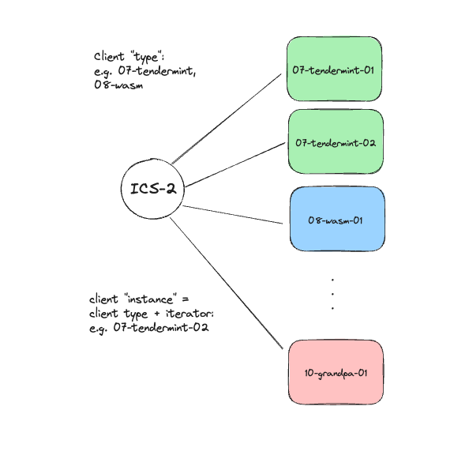

# IBC clients - reimagined

IBC was originally designed to be an **open, permissionless and trust-minimized interoperability protocol**. These requirements led to the design of the (light) client based approach, specified in the [02-client specification](https://github.com/cosmos/ibc/blob/main/spec/core/ics-002-client-semantics/README.md).

As the IBC protocol originated withing the Cosmos ecosystem for chains with Tendermint consensus, the most common IBC client is the [tendermint client](https://github.com/cosmos/ibc/blob/main/spec/client/ics-007-tendermint-client/README.md). The IBC connections built on top of the Tendermint IBC clients used in the early phases of (production) IBC, are based on _remote_ consensus proof verification on the host chain (i.e. the chain that runs the light client). **Thus, in this case the security of IBC reduceds to the security of the connecting chains and the connection is trust-minized.**

Many in the IBC community have thus started to consider the IBC protocol as synonymous with consensus proof based light clients. Recently however, due to work of among other the Polymer team, this is changing.

:::tip Remember what the client is, and you'll intuitively understand why it can be diverse

A short and succinct summary of a light client's functionality is the following: **a light client stores a trusted view of the remote chain or "consensus state", and provides functionality to verify updates to the consensus state or verify packet commitments against the trusted root**.

As you can see, we need a trusted initial view of the remote chain and a way to verify updates. The way this verification is done, is an _implementation_ detail. This understanding opens up the design space for IBC clients.

:::

We'll give a short overview of the different verification methods that can also be implemented by an IBC client, but first let's take a look at a more basic client diversity.

## IBC clients for heterogenuous chains

Even though IBC was originated as part of the Cosmos vision of interoperable L1s, mostly built using Tendermint consensus and Cosmos SDK, the team responsbile for desinging the specification took no shortcuts and **built the protocol for a heterogenous network of many different chains with different consensus types**, existing and future ones.

To ensure maximal compatibility, the [requirements on hosts chains to implement IBC](https://github.com/cosmos/ibc/blob/main/spec/core/ics-024-host-requirements/README.md) were intentionally kept minimal.

As such, for each chain with a different type of consensus, there will be a different _client type_ which will define rules for the client to verify according to the protocol of said consensus type.

:::note Non-Tendermint clients

Initially, IBC adoption outside of Cosmos SDK chains (with Tendermint consensus) has been rather slow, but this is picking up. For example, there is the [GRANDPA client](https://github.com/cosmos/ibc/blob/main/spec/client/ics-010-grandpa-client/README.md) developed for chains from the Polkadot ecosystem.

:::

### Client type vs client instance

It's important to realize the difference between client types and client instance, i.e. an instance of said type. This impllies that there are only a few different client types corresponding to chains with different concensus protocol. For each instance an monotonously increasing sequence number is assigned to identify different instances.

Client are then denominated as follows : `<ICS spec number>-<name string>-<iterator>`. For example: `07-tendermint-123` for Tendermint chains or `10-grandpa-345` for a Polkadot/Substrate chain.

## IBC clients: beyond consensus proof verification 

As mentioned above, he client definition is loose enough to allow for verification beyond consensus proofs to update its view of the remote chain. Multi-signature, single signature, threshold signatures and more can all be considered valid clients. Any of the trust mechanisms in the [interoperability landscape section](../../background/landscape.md) can be represented as an IBC client.

<!-- Review this section a bit more -->

- **Solomachine**: the [IBC solomachine client](https://github.com/cosmos/ibc/blob/main/spec/client/ics-006-solo-machine-client/README.md) is a client that allows a single machine with a public key (can be a single public key or a multi-signature public key) to implement the unified IBC client interface to use the IBC transport layer.

- **Optimistic clients**: the client would accept new headers optimistically and update the ConsensusState, with the ability to submit fraud or fault proofs by a challenger within a fraud window. There is also an honest minority assumption or a 1-of-N assumption security wise.

- **ZK clients**: the client would be able to verify ZK proofs as validity proofs to prove state transitions rather than consensus.

:::tip Rollups anyone?

The above Optimistic and ZK clients might sound very analogous to the verification mechanism used in rollups. Indeed, a rollup essentially is a _view into another chain (the rollup)_ from its settlement layer and thus the same range of proving methods can be utilized.

:::

## Even more diversity...

Extending the IBC clients to allow for verification beyond consensus proofs is one element to make clients more diverse. There is another element we still need to consider though, the modular paradigm. Read on in [the next section](./modular-ibc.md) to find out how IBC can work in the modular world.
