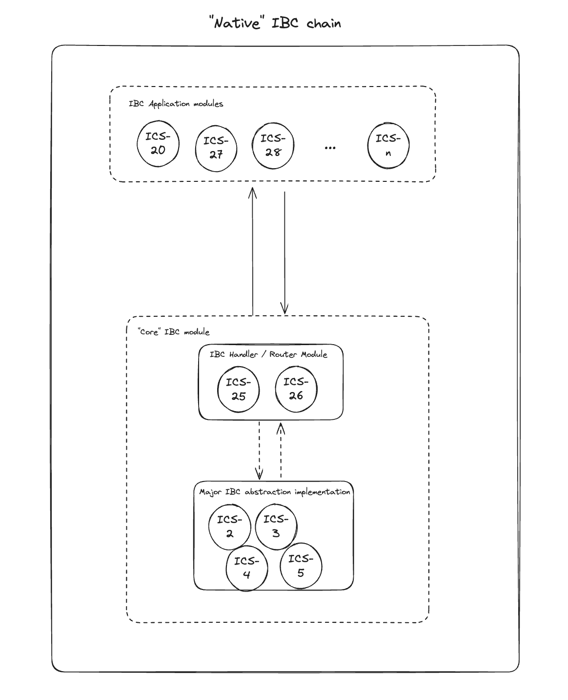
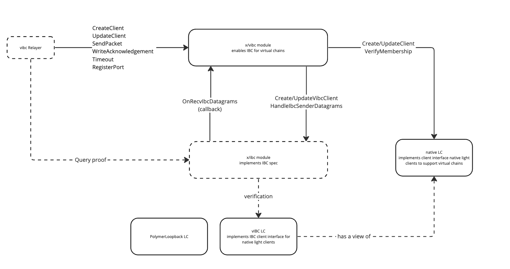

# vIBC architecture components

At a high level, a virtual chain is outsourcing its interoperability workload to Polymer. Polymer establishes:

- a virtual IBC connection to virtual chains and 

- a concrete IBC connection to IBC native chains 

:::note

Note that chains are not required to connect virtually to Polymer. Chains can establish non-virtual IBC connections with Polymer as well.

:::

## Modularizing IBC

How can we reason about the implications of outsourcing the transport layer to Polymer, or modularizing IBC?

Let's consider this diagram for **native  IBC chains**.

IBC applications interact with the core IBC implementation that implements the client, connection and channel abstractions through the IBC handler and router submodule. In native IBC, these are all part of the same chain environment.

Consider now the following diagram where **vIBC is introduced to enable IBC on a virtual chain**, through outsourcing its interopeability workload onto Polymer.

- **IBC applications**: IBC application modules can be developed on the virtual chain as if it were a native IBC chain. Refer to the [IBC in Solidity section](../../build-dapps/ibc-solidity/ibc-solidity.md) to learn how to build IBC enabled smart contracts on virtual chains.

- **vIBC core smart contracts**: These contracts, deployed on the virtual chain, facilitate the IBC apps on the virtual chain to communicate with the transport layer on the remote Polymer hub by binding to it asynchronously. Refer to the [vIBC core contracts section](../../build-dapps/ibc-solidity/vibc-core.md) to find out more.

- **vIBC relayer**: A relayer that listens to events related to the IBC lifecycle, emitted by vIBC core smart contracts, it then relays these events to the vIBC module on Polymer.

- **vIBC module**: Essentially a module that manages the translation of the virtual IBC world to the regular IBC world (provided by Polymer's native IBC module) and vice versa.

:::tip How to reason about vIBC?

From the diagrams above, it should become clear that vIBC is essentially the answer to the question _"how to adapt IBC when it is modular"_, i.e. the transport layer lives on another chain than the applications using it.

Another way look at it, is to consider it an extension of the IBC router submodule (from the _monolithic_ IBC context) to facilitate IBC communication asynchronously across chains.

:::

## vIBC relayer
What are relayer in the world of IBC? Let's consult the [relayer spec, ICS-18](https://github.com/cosmos/ibc/tree/main/spec/relayer/ics-018-relayer-algorithms):

> Relayer algorithms are the "physical" connection layer of IBC — off-chain processes responsible for relaying data between two chains running the IBC protocol by scanning the state of each chain, constructing appropriate datagrams, and executing them on the opposite chain as allowed by the protocol.

When introducing a virtual chain, as can be seen in the diagram above, we introduce several components (vIBC core smart contracts, vIBC module) on different chains that interact with one another asynchronously. Just like its regular IBC counterpart, we need a relayer to relay data between the different components of the vIBC protocol. This is the _vIBC relayer_ and it is responsible for:

- listening for IBC events related to channel or packet lifecycle on the virtual chain to relay datagrams to Polymer's vIBC module

- listening for specific IBC events on Polymer to relay to the virtual chain's vIBC core smart contract

## vIBC module on Polymer

The vIBC module is the IBC entrypoint for virtual chains. The main differentiation point from the canonical IBC module is that the vIBC module handles the same things asynchronously and also for more diverse client types. 

The vIBC module is implemented as an IBC enabled Cosmos SDK module that supports:

- remote registration of ports for IBC enabled contracts

- management of native clients without single slot finality and more

- producing virtual roots from the consensus states of a native light client

- manage creation and updates of virtual clients (IBC compatible)

- propagate IBC datagrams from virtual chains to the IBC module

:::tip How to reason about the vIBC module?

You can think of the vIBC module as the "translation layer" between everything that is not natively IBC, related to the virtual chains, into the IBC world and vice versa.

:::

<!-- TODO: update diagram -->

We look at the implications for clients and the computation of the virtual root or transport commitment in more detail next.

