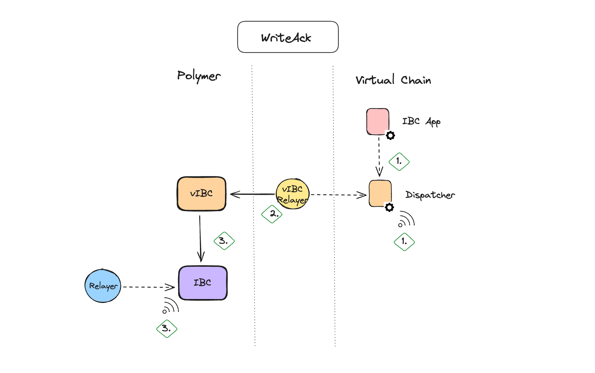
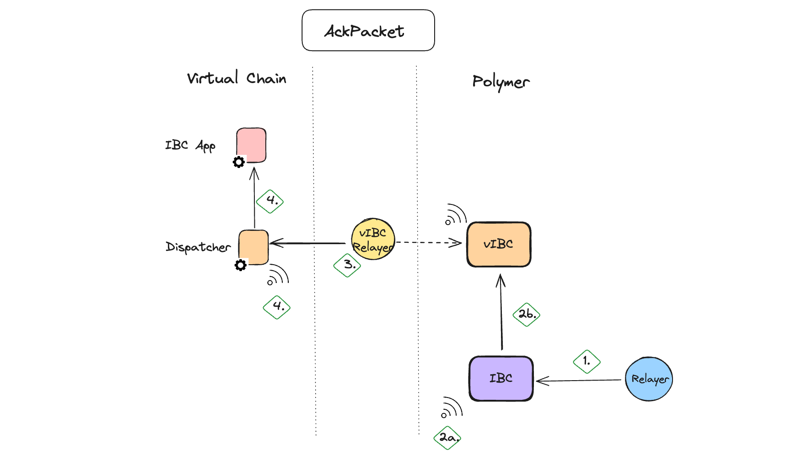

# Packet lifecycle with vIBC

The previous sections explained the architecture and different components that make up virtual IBC or vIBC. Armed with this knowledge, we take a look at the packet lifecycle when sending packets over a multi-hop channel that involves one or more virtyal chians.

:::tip Remember IBC packet flow

When both the source and destination chain of the data to be sent cross-chain are native IBC chains, the resulting packet flow is as follows:

:::

Aided by relayers querying events and relaying packet data, the IBC packet flow is a feedback loop that begins with sending a packet on a source chain, receives the packet on the destination and ends when there's an acknowledgement back on the source. 

When introducing a virtual chain to the picture (could be on one side or on both sides), we essentially break up the synchronous boundary between application and transport layer on the same chain and bind them async on separate chains.
This introduces some _subcycles_ to relay information between Polymer, the interoperability hub, and the virtual chains that are using Polymer's interoperability service to connect to the IBC network.

:::note Which subcycles are virtual? 

Without loss of generality, we break up the IBC packet cycle into some subcycles and investigate how it works for a virtual chain outsourcing IBC workload to Polymer. Following setups are possible:

- Virtual chain <-> Polymer <-> Virtual chain : All subcycles will be using virtual IBC

- Virtual chain <-> Polymer <-> IBC compatible chain: 
  - Virtual chain is source of packet: `SendPacket` and `Acknowledgement` use vIBC procotol
  - Virtual chain is destination of packet: `RecvPacket` and `WriteAcknowledgement` use vIBC protocol

:::

:::info Want more details?

The below overview is high-level and is mainly concerned with understanding the different steps in the packet lifecycle when introducing vIBC. A more thorough analysis handling all detailed state updates, verifications etc. can be found in the [vIBC specification](https://github.com/polymerdao/polymerase/blob/main/chain/docs/vibc/vibc-api-spec.md).

:::

## `SendPacket` cycle

- **Step 1**: The IBC enabled smart contract calls the dispatcher's `SendPacket` method to send a custom defined IBC packet.

- **Step 2**: The dispatcher vIBC core contract emits a `VirtualSendPacket` event.

- **Step 3**: The vIBC relayer picks up the event and submits a `MsgVirtualSendPacket` to the vIBC module, along with the inclusion proof (for the event).

  :::caution Updating native client

  To verify inclusion of the packet event in the submitted header, a relayer needs to update the native client on Polymer.

  :::

- **Step 4**: Pending successful verification, the vIBC module calls the IBC module's `SendPacket` method. This will set the packet commitment to the IBC store.

- **Step 5**: The IBC module will emit an `EventSendPacket` event, which can be picked up by regular IBC relayers.

## `RecvPacket` cycle

- **Step 1**: An IBC relayer picks ups  an `EventSendPacket` event and submits a `MsgRecvPacket` to Polymer's IBC module, along with the proof of inclusion.

  :::caution Updating client

  Again, to verify inclusion of the packet commitment in the submitted header, a relayer needs to update the client reprenting the counterparty on Polymer.

  :::

- **Step 2a**: The IBC module emits an `EventRecvPacket` event. It also stores a receipt in the IBC store.

- **Step 2b**: The vIBC module's `onRecvPacket` callback is called. A `VirtualRecvPacketReq` event is emitted, which can be picked up by vIBC relayers (not regular IBC relayers).

  :::note Only asynchronous writing of acknowledgment in vIBC
  In regular IBC context, the application developers have the choice to either write acknowledgements synchronously (during the `onRecvPacket` callback an acknowledgement is written) or asynchronously (a _nil_ acknowledgement is passed in the callback) at a later time.

  In vIBC context however, given the asynchronous nature of binding the virtual chain's applications, **only the asynchronous mode is used**.
  :::

- **Step 3**: The vIBC relayer submits a tx that calls the dispatcher contract's `recvPacket` method (an inclusion proof is submitted for the receipt `packetRecvCommitment` on Polymer).

- **Step 4**: The dispatcher contract will emit a `VirtualRecvPacketResp` event (mainly for debugging purposes).

- **Step 5**: The `onRecvPacket` callback of the IBC application contract is called. This will start the next cycle... .

## The `WriteAcknowledgement` cycle

- **Step 1**: During the dispatcher's `recvPacket` call, the application will provide an acknowledgement (`AckPacket`) and this will be set to local state, as well as emit a `VirtualWriteAck` event, that can be picked up by a vIBC relayer.

- **Step 2**: The vIBC relayer picks up the `VirtualWriteAck` event and submits a `MsgWriteAcknowledgement` to the vIBC module, along with proof of the event on the virtual chain.

- **Step 3**: the vIBC module will call into the IBC module's `WriteAcknowledgement` method. This emits an `EventWriteAck` event which can be picked up by regular IBC relayers.

## The `Acknowledgement` cycle

- **Step 1**: A regular IBC relayer has picked up an `EventWriteAck` event and will submit a `MsgAcknowledgement` to Polymer's IBC module. 

- **Step 2a**: The IBC module emits an `EventAcknowledgePacket` event. This is not picked up by IBC relayers as the acknowledgement is usually the end of the packet flow. In vIBC however, we still need to relay the acknowledgement to the virtual chain. Additionally, the packet commitment corresponding to this packet will be deleted to avoid replay.

- **Step 2b**: The IBC module calls into the vIBC module's `onAcknowledgePacket` callback. This callback will emit an `VirtualAcknowledgePacketReq` event, to be picked up by the vIBC relayers.

- **Step 3**: The vIBC relayer picks up the `VirtualAcknowledgePacketReq` event and submits a tx that calls into the dispatcher contract's `acknowledgement` method, along with the membership proof of the `AckPacket` on Polymer.

- **Step 4**: The dispatcher contract emits a `VirtualAcknowledgePacketResp` event and call into the IBC app contract's `onAcknowledgePacket` callback.

## Summary

To summarise one could say that when introducing vIBC:

- we create a new domain, the virtual IBC domain, with new event types, a vIBC module on Polymer, vIBC relayer and vIBC core contracts on the virtual chain which interact in this domain
- the vIBC module is responsible for translating between the vIBC and IBC domain
- the vIBC relayer listens to _virtual_ events and submits transactions to the vIBC module on Polymer
- the regular IBC relayer will listen to standard IBC events and submit transactions to the IBC module on Polymer